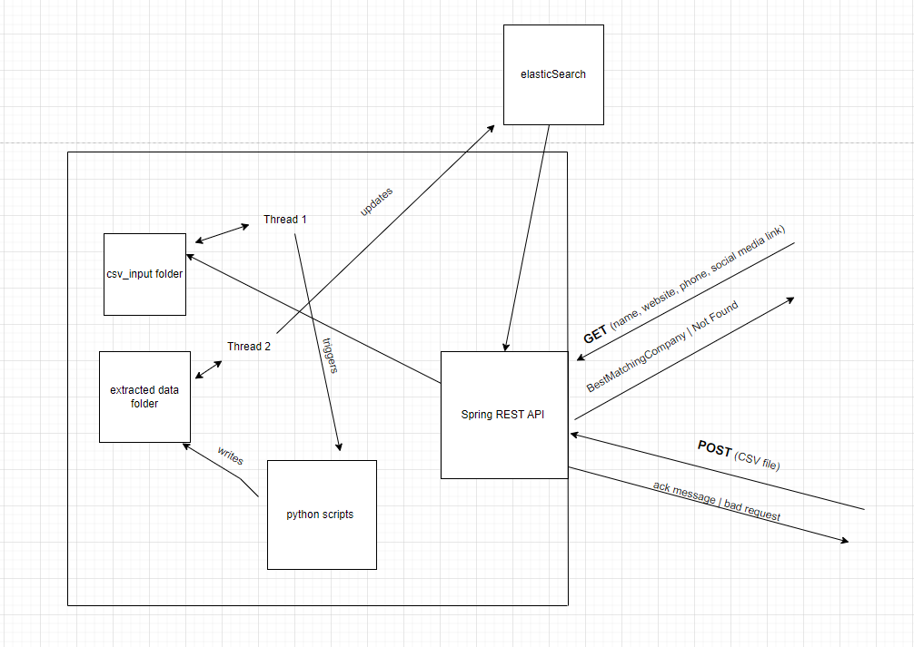
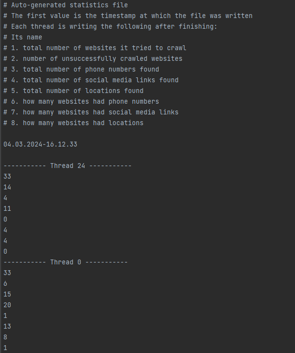
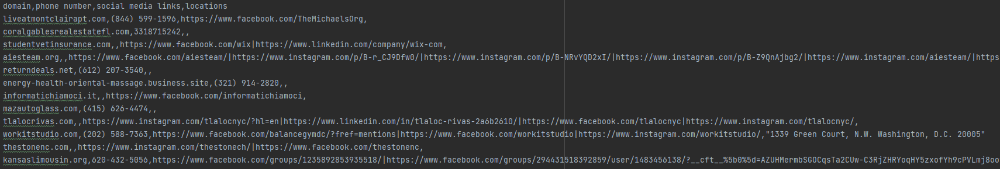
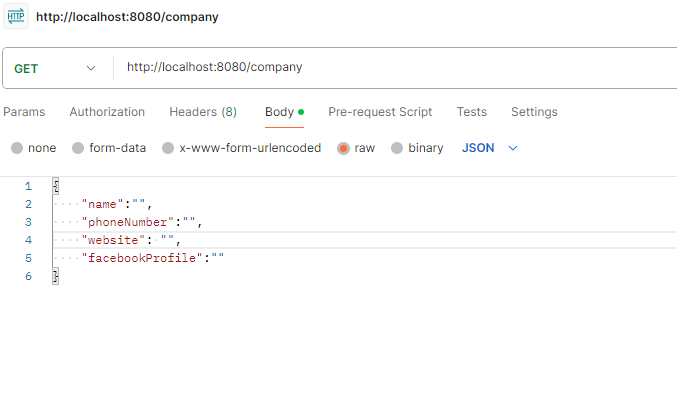
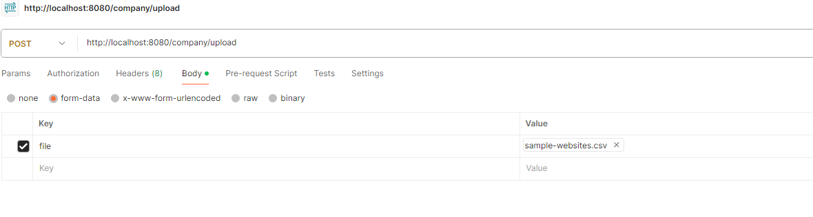

# Overview: 
This projects achieves the following:
1. Scrapes domains in a multithreading fashion for preconfigured datapoints (phone numbers, social media links, locations)
2. Analyzes scraped data and creates useful diagrams
3. Aggregates scraped data with existing one
4. Exposes an API for starting asynchronous processing of CSV domain files and retrieving best matching company on multiple datapoints input 
# Tech Stack used 
 - Python -> scraping domains + generate analysis
 - Java Spring Boot -> API handling bestMatching (GET) + async handling of CSV files to be processed by the python scripts (POST)
 - ElasticSearch -> storing and returning requested data
# Logic Overview 

# Scraping part + analysis part (scraping_dir)
Location: **scraping_dir/scrapingScript.py** 

The script ca be run both as standalone or as part of the POST api workflow (controlled by the application.properties values)

Parameter | Description                            | required | application.properties    |
---------- |----------------------------------------|----------|---------------------------|
-f / --file    | Path to CSV file to be processed       | yes      | file.processing.directory | 
-s / --social | Path to targeted social media links file | yes      | no                        |
-t / --threads    | Number of threads to process the file  | yes      | python.scraping.threads   | 
-v/ --verbose | Should error logs be displayed         | no       | no                        |
-f / --file    | Path to CSV file                       | yes      | file.processing.directory | 

## How does the scraping script work 

1. Each thread receives an equal chunk of data to process (the last thread receives everything that is left)
2. Threads start to process -> storing data in local thread variables
3. Parent process generates two files *statistics.txt* (current dir) and *still_processing.txt* (extracted data dir)
4. When each thread finishes scraping, acquires locks and write to those files  
5. After threads finish, parent process computes running time and writes it along with the timestamp to the statistics.txt file 
6. Marks the data file as "ready to be processed" -> for the java thread
7. Runs analyze script on statistics file

Snippet of statistics file 



Snippet of extracted data file



## How does the analyzer script work
1. Analyzes data based on statistics txt file 
2. Adds the total runtime of scraping script at the end of it
3. Computes graphical representation of extracted data in **statistics** folder
4. Marks files as processed by adding timestamps to them

# Data aggregation part

1. Data from sample-websites-company-name.csv is added to elasticSearch by **add_company_data_to_elastic.sh** script (along with a little formatting)
2. Documents are being updated by the content of the data file

# The querying part

1. API receives a GET request containing one or more datapoints
2. Tries to get the best match company from elastic by using levenshtein distance's logic
3. If no data is found, keeps increasing the levenshtein distance until the **levenshtein.max.distance** is reached
4. Returns the company data/ Not found response 

# Full workflow overview

1. After spring context is initialized, 2 threads are starting to read certain folders (controlled by processing.threads.sleep.interval) 
2. A csv is sent to API via post request and an acknowledge message is returned 
3. After validation, the csv is placed in **csv_input** folder
4. The first thread runs python process and marks file as processed
5. After scraping is done, the data file is placed in **extracted_data** directory
6. The second thread updates documents on elastic and marks file as processed

# How to run the project

clone it locally 
```
git clone https://github.com/radumocanu1/SearchAPI.git
```
navigate to elasticConfig
```
cd CompanyApi/elasticConfig
```
create docker network for elasticsearch and kibana
```
docker network create customnetwork
```
start elasticsearch container
```
docker run -d -p 9200:9200 -p 9300:9300 --name elasticsearch --network customnetwork -e "discovery.type=single-node" elasticsearch:7.14.0

```
start kibana container
```
docker run -d -p 5601:5601  --network customnetwork -v kibana.yaml:/usr/share/kibana/config kibana:7.14.0
```
Note: you should see kibana UI on http://localhost:5601/ 

use git bash to run add data to elastic script
```
bash add_company_data_to_elastic.sh
```

Choose the desired parameters in application.properties

Run spring app

GET requests -> localhost:8080/company 

POST requests -> localhost:8080/company/upload
